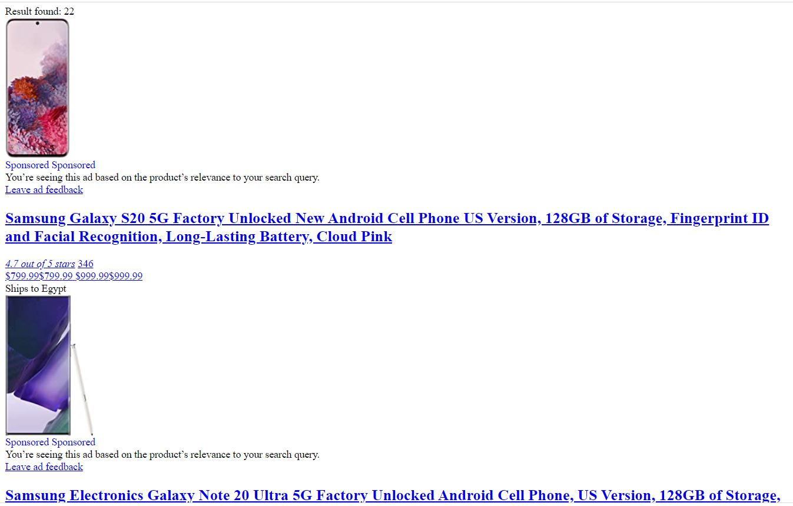

# amazon_proudcts_checker
this app check if product exist or not one amazon, next step to click on add cart 

## important note:
Maybe you can use tools or advanced technique readed from book, or from course, But I did that from scratch that's mean you I can make a book and you can only copy 

### IBAN API 

https://www.iban.com/exchange-rates-api

### features

1. escap sponsored items (no one can do it better than that).
2. scrape amazon in professional way.
3. get name and link for each item.
4. handle any errors 0 errors
5. use of AJAX.
